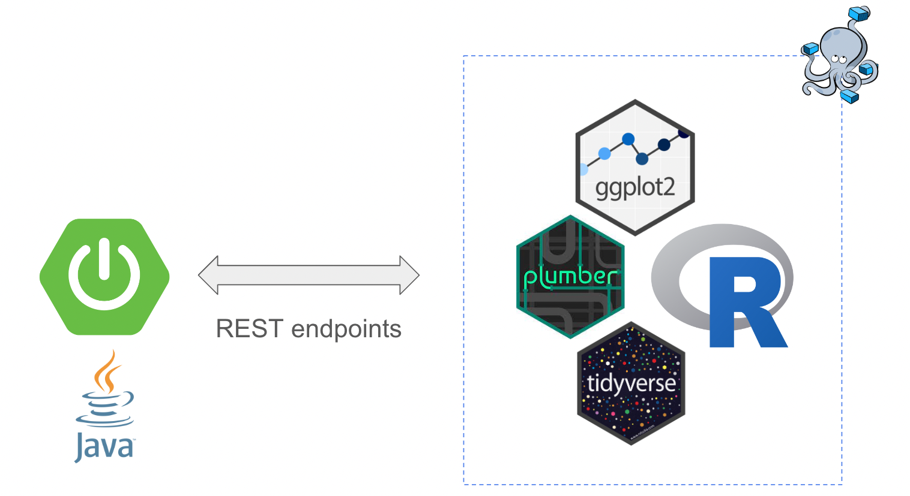
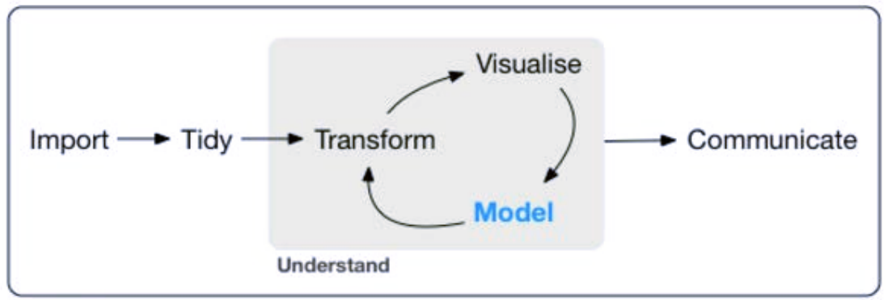

# Spring Boot & R Stat Server

[](https://github.com/jabrena/spring-boot-and-r-language/actions/workflows/maven.yml)

**Cloud IDEs:**

[](https://gitpod.io/#https://github.com/jabrena/spring-boot-and-r)

---


## Motivation

A repository to explore how to interact with **R** from **Java** with **Spring Boot** in order to use both programming languages to extract knowledge from data samples.



## Process



## How to run the project from Spring Boot

```bash
docker compose build
./mvnw spring-boot:run

curl "http://localhost:8080/"
curl -v http://localhost:8080/download/employee.csv
```

## How to run the project from Docker compose

```bash
docker compose build
docker compose up -d

curl "http://localhost:3000/"
curl "http://localhost:3000/echo"
curl "http://localhost:3000/echo?msg=hello"
curl "http://localhost:3000/plot"
curl "http://localhost:3000/sum" -H "Content-Type: application/json" --data '{"a":4, "b":5}' 

#Swagger from Plumber
open http://localhost:3000/__docs__/

docker compose down
```

**RStudio:**

```
open http://localhost:8787/
```

## References

- https://spring.io/projects/spring-boot
- https://hypermedia.systems/book/contents/
- https://rocker-project.org/
- https://www.rplumber.io/
- https://github.com/rstudio
- https://www.r-project.org/
- https://r-graph-gallery.com/
- https://www.tidyverse.org/

## Previous works:

- https://stat.ethz.ch/pipermail/r-help/2006-June/107869.html

Made with ❤️ from Madrid